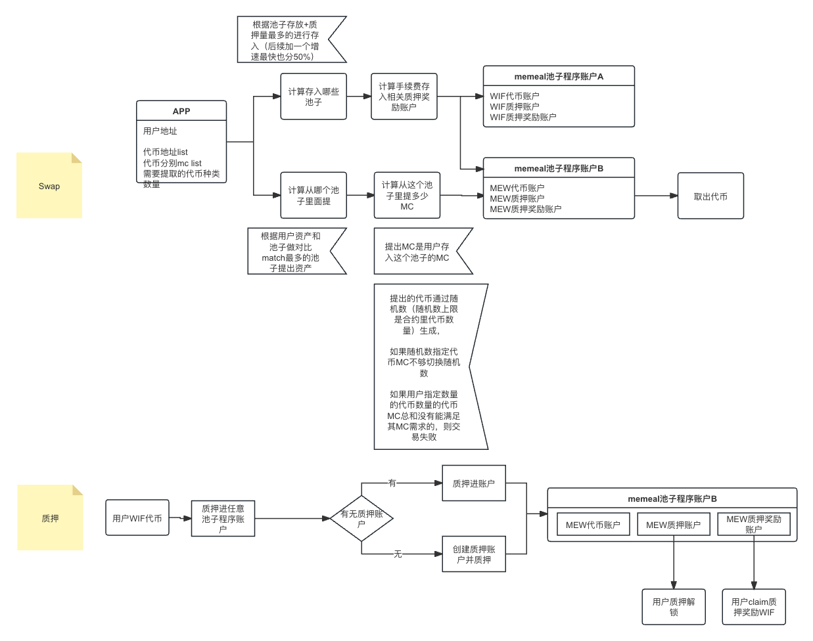

# Solana Meme Alchemy
## Our Goal
To empower countless memecoin in solana and let user exchange, swap, deposit their memecoin based on theme and play!
## Workflow

## Frontend Design
https://www.figma.com/file/QcJl0Qe3MvAbunpI2iChUu/Untitled?type=design&node-id=0-1&mode=design&t=gbgHK7VdaYcAbxw7-0

## Contract Breakdown

### Instructions

#### 1.init_pool

Initialize a new meme pool, requires a signature from the <code>program_authority</code>. The pool is a pda with the address of the token mint that the pool is intended for and "state" as seeds.

#### 2. init_deposit_entry

Initialize an account to hold state about a pool's deposit position. PDA with the user's pub key, mint of token, the token mint address, and "deposit_entry" as seeds.

#### 3. Deposit

Transfers tokens from a User token account to the program token vault, where they are kept while staked.

#### 4. Swap

Transfers tokens from a user token account to the program token vault, and randomly transfer some of the token in the vault back to the user.

#### 

